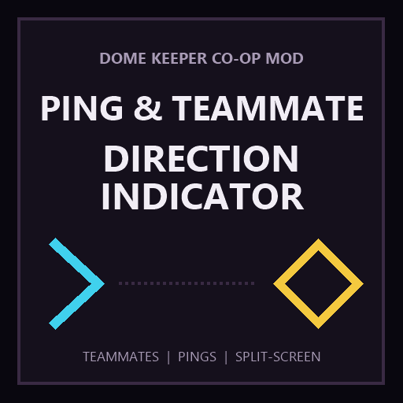

# Ping&Teammate direction indicator



A lightweight co-op HUD mod for Dome Keeper. It adds edge indicators for off-screen teammates and synchronized position pings for online and local split-screen multiplayer.

## Features

- Cyan edge chevrons point toward off-screen teammates.
- Yellow edge chevrons and diamond markers show player pings.
- Short presses create 60-second pings; long presses create 5-minute pings.
- Pressing ping again near your existing marker cancels it.
- Every local split-screen player receives an independent overlay.
- Ping bindings appear under `Settings > Key Bindings > General > Team Ping`.
- Default controls: middle mouse button and right-stick click (R3/RS).

Pings mark the Keeper's current position, rather than the mouse cursor or aim point.

## Important

In the default Steam release of Dome Keeper, community mods do not load automatically. To use this mod, you must first apply the Mod Loader Patcher, which enables compatible Workshop mods to load in the game.

## Step-by-step installation

1. Click the `+ Subscribe` button on the Steam Workshop page.
2. In your Steam Library, right-click Dome Keeper, select `Properties > Betas`, then change Beta Participation to `staging`. Steam will download a small update.
3. Download [DomeKeeper_ModPatcher.zip](https://github.com/LeonardoLuca/dome-keeper-coop-mod-patcher/releases/latest/download/DomeKeeper_ModPatcher.zip).
4. Extract the entire ZIP into the game installation folder where `domekeeper.pck` is located. In Steam, use `Dome Keeper > Manage > Browse local files` to find it.
5. Make sure the game is closed, then run `instalar_mod.bat`. The patcher backs up the original game file and save data, enables Mod Loader, and installs Shared Upgrades.
6. Launch the game. After the patcher is installed, this mod loads automatically from Steam Workshop.

If Dome Keeper updates through Steam, run `instalar_mod.bat` again to reapply the patcher if necessary.

## Manual installation

1. Download `Codex-TeamPingHud.zip` from the [latest GitHub release](https://github.com/ltx001/DomeKeeper-Ping-Teammate-Direction-Indicator/releases/latest).
2. Place it in the Dome Keeper `mods` directory next to `domekeeper.pck`.
3. Start the patched game.

`Codex-TeamPingHud` remains the internal mod ID so existing installations and settings continue to work after the public title change.

## Building

Run:

```powershell
powershell -ExecutionPolicy Bypass -File .\package.ps1
```

This creates `dist/Codex-TeamPingHud.zip`. To also install it locally:

```powershell
powershell -ExecutionPolicy Bypass -File .\package.ps1 -GameDir "D:\path\to\Dome Keeper"
```

The archive uses forward-slash ZIP entry paths required by Mod Loader 7.x.

## Compatibility

- Dome Keeper 5.0+
- Dome Keeper Mod Loader 7.0.1+
- Online co-op and local split-screen

## License

Released under the [MIT License](LICENSE).
